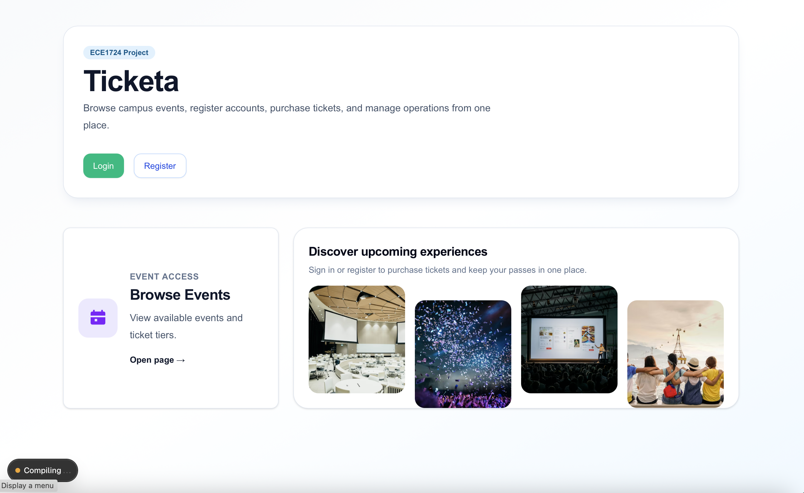
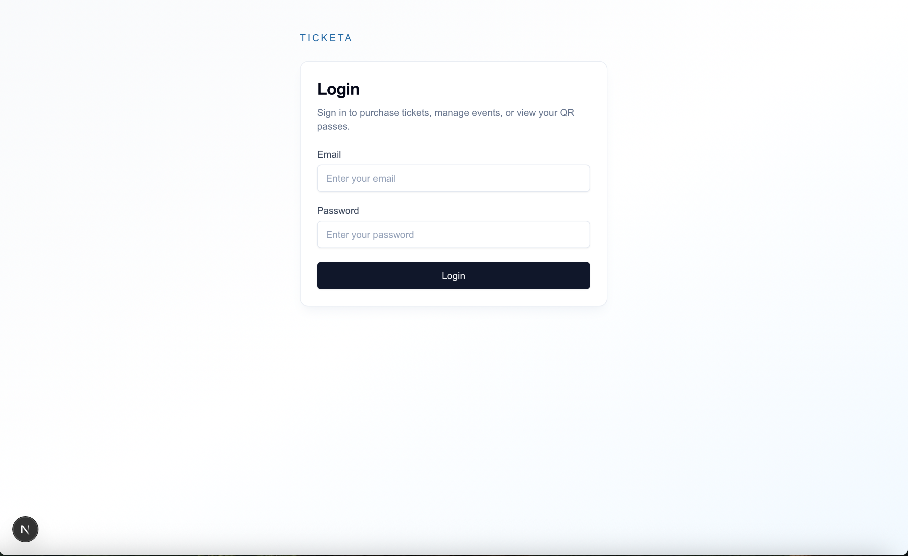
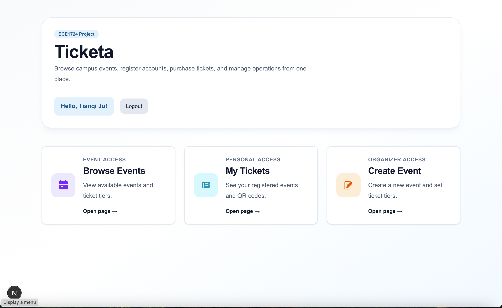
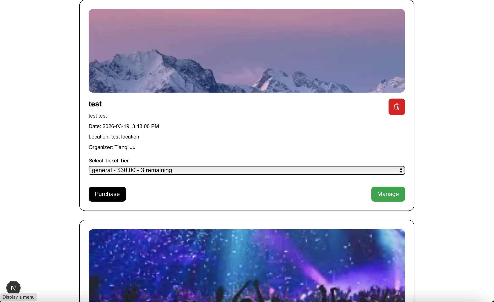
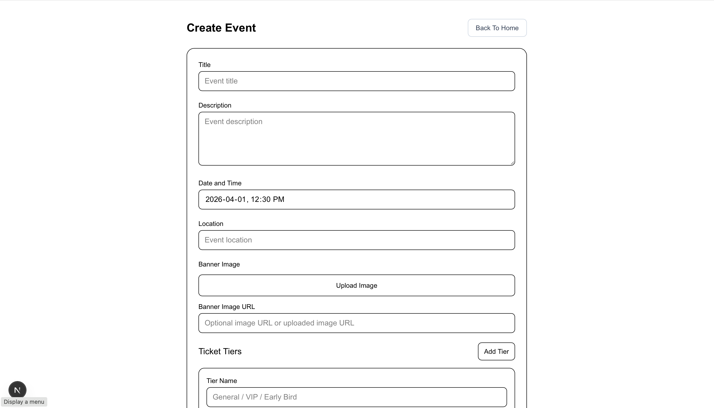
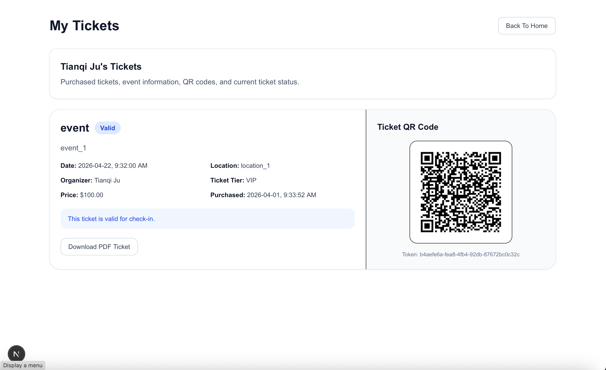
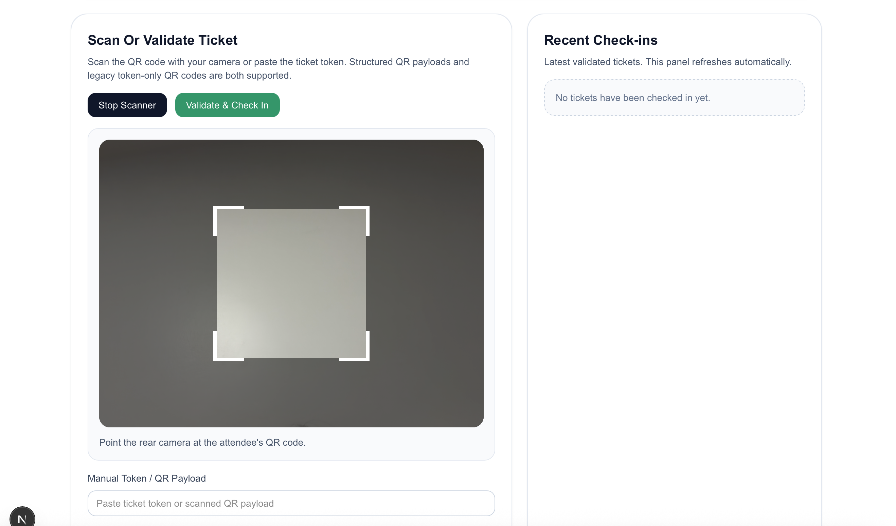
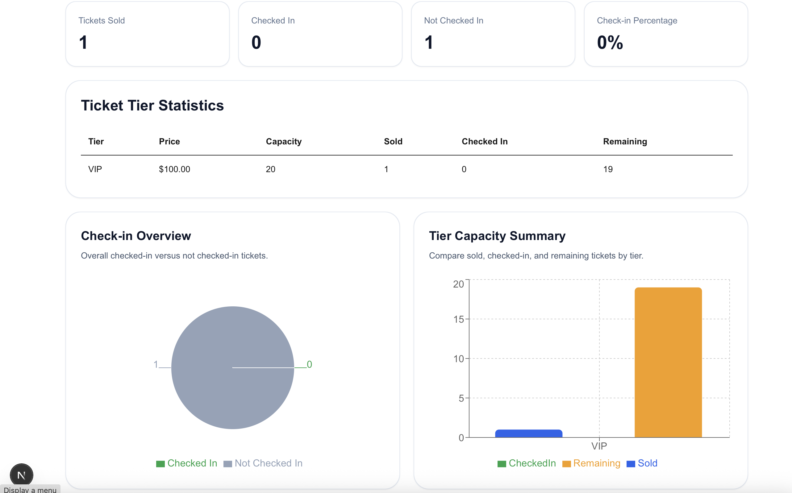

# Final Report

> Template only. Fill in each section before submission.

## Team Information

- Name:Tianqi Ju
    - Student Number: 1012870467
    - Preferred Email: tianqi.ju@mail.utoronto.ca

- Name: Rosalind (Yuanyu) Wang
    - Student Number: 1006930519
    - Preferred Email: rosalind.wang@mail.utoronto.ca

- Name: Eric (Haobo) Wang
    - Student Number: 1006669384
    - Preferred Email: hbo.wang@mail.utoronto.ca

- Name: Kaiwen Yang (Kevin)
    - Student Number: 1007648066
    - Preferred Email: kaiwen.yang@mail.utoronto.ca

## Motivation

Event management is a recurring need in university clubs, student associations, workshops, conferences, and community activities, yet many small and medium organizers still rely on fragmented workflows. Registration is often handled through forms or spreadsheets, confirmations are sent manually by email, and on-site entry is checked by comparing names or static screenshots. These approaches are slow, error-prone, and difficult to scale once attendance grows.

Our team chose this project because it solves a practical and familiar problem with clear real-world value. In a typical manual workflow, organizers have limited visibility into ticket sales, staff cannot verify attendees efficiently at the venue, and attendees experience long check-in lines and inconsistent ticket handling. Fraud prevention is also weak when there is no structured ticket identity, no server-side validation, and no reliable record of whether a ticket has already been used.

We wanted to build a system that turns event operations into a structured digital workflow. A full-stack ticketing and QR-based check-in platform allows organizers to create events and ticket tiers, attendees to register and receive digital tickets, and organizers or staff to validate entry quickly with immediate feedback. This is meaningful not only because it improves convenience, but also because it demonstrates strong integration across frontend UI, backend logic, authentication, database operations, file generation, email delivery, and cloud storage.

From a course perspective, the project was a strong fit because it naturally requires the technologies and software engineering concerns emphasized in the assignment. It involves a modern frontend, a backend API layer, relational database design, cloud asset storage, role-based authorization, and multiple advanced features working together in one coherent application. The problem is substantial enough to demonstrate technical depth, but still concrete enough that correctness can be evaluated through real user flows.

## Objectives

The primary objective of the project was to design and implement a complete event ticketing system that supports the full lifecycle of an event, from creation to attendee check-in. We aimed to produce a coherent application rather than a collection of isolated features, so the system needed to connect event setup, ticket issuance, attendee access, and event-day operations through one consistent data model and user flow.

More specifically, our team aimed to achieve the following:

- Build a role-based platform with separate experiences for organizers, staff, and attendees.
- Allow organizers to create events, define ticket tiers, and manage event operations.
- Allow attendees to register, log in, browse available events, purchase tickets, and access their issued QR tickets.
- Support secure QR-based check-in with server-side ticket validation and duplicate check-in prevention.
- Provide organizers and assigned staff with a dashboard for attendance monitoring and operational management.
- Integrate supporting services that make the application feel complete in practice, including email confirmations, downloadable PDF tickets, and cloud-hosted event images.

Beyond functional goals, we also aimed to satisfy the course requirements in a technically meaningful way. The implementation was expected to demonstrate TypeScript across the stack, a Next.js full-stack architecture, relational database operations through Prisma and PostgreSQL, Tailwind CSS based UI development with `shadcn/ui` components, and cloud storage functionality through DigitalOcean Spaces. We therefore treated correctness, integration, and usability as core objectives, not optional polish.

## Technical Stack

The application is implemented as a Next.js full-stack web system using TypeScript for both client-side and server-side logic. This approach allowed us to keep the frontend pages, API routes, validation logic, and shared utility code in one cohesive codebase while still maintaining clear separation of responsibilities between UI components, route handlers, and backend helper modules.

On the frontend, we used React through the Next.js App Router to build the user interface. Styling is primarily handled with Tailwind CSS, and we integrated `shadcn/ui` components for reusable UI primitives such as cards, buttons, inputs, alerts, badges, and labels. This stack was used to build the landing page, authentication forms, event creation flow, event browsing interface, personal ticket views, and organizer/staff dashboard interactions. For data visualization on the dashboard, we used Recharts to present check-in and ticket statistics.

On the backend, we used Next.js Route Handlers under `app/api` to implement the application logic. These handlers cover user registration and login, event creation and retrieval, ticket purchasing, dashboard access, staff assignment, ticket PDF generation, and image uploads. Validation is performed with Zod schemas, which helped ensure that user input is checked consistently before any database write occurs. Authentication is implemented with JWT-based tokens, password hashing is handled with `bcrypt`, and role-based access control is enforced in backend routes and dashboard operations.

For the database layer, we used PostgreSQL together with Prisma ORM. Prisma models define the core entities of the system: `User`, `Event`, `EventStaff`, `TicketTier`, and `Ticket`. These relationships allow the system to support organizer-owned events, assigned staff, ticket tiers with quantity limits, per-user ticket ownership, and ticket status updates at check-in time. Prisma queries and transactions are used throughout the backend to enforce constraints such as preventing duplicate ticket purchases and ensuring ticket-tier inventory is respected.

Several additional technologies were integrated to support the complete workflow:

- `qrcode` is used to generate per-ticket QR code images.
- A structured QR payload format is used so the dashboard can validate that a scanned ticket belongs to the correct event.
- `html5-qrcode` powers browser-based scanning in the event dashboard.
- `pdf-lib` is used to generate downloadable PDF tickets containing ticket details and the QR code.
- Resend is used for registration confirmation and ticket purchase confirmation emails.
- DigitalOcean Spaces, accessed through the AWS S3 client, is used for cloud storage of uploaded event banner images.

Overall, the stack reflects the final implementation rather than only the proposal. In particular, the system demonstrates all of the major required technical areas in the rubric: TypeScript, a Next.js/React frontend, a Next.js backend, database operations with PostgreSQL and Prisma, cloud storage functionality, and a modern responsive UI supported by Tailwind CSS and `shadcn/ui`.

## Features

The implemented system covers the complete core workflow of an event ticketing platform and integrates the main technologies required by the course project. The features below are not standalone demos; they operate together through shared authentication, database relationships, and user flows.

### 1. Authentication and Role-Based Access Control

The platform supports account registration and login for three roles: `ORGANIZER`, `STAFF`, and `ATTENDEE`. Registration validates the input using Zod, stores hashed passwords, and sends a confirmation email when email configuration is available. Login verifies credentials and returns a JWT used for authenticated requests.

Role-based access control is enforced both in the interface and in backend logic. Only organizers can create events, only organizers can assign staff to their own events, and only organizers or assigned staff can access the management dashboard for a given event. This feature is important because it provides the security and separation of responsibilities needed for a multi-user operational system rather than a single-user prototype.

### 2. Event Creation and Event Browsing

Organizers can create events by entering event details, setting a future date and time, adding one or more ticket tiers, and optionally uploading a banner image. Each ticket tier includes a name, price, and quantity limit. Validation is performed on both the client and server to ensure incomplete or invalid event data is rejected before it reaches the database.

All users can browse events through a central listing page. The event list shows event details, organizer information, optional banner images, available ticket tiers, and remaining ticket counts. Organizers can delete their own events, while organizers and assigned staff can navigate directly to the event management dashboard. This feature establishes the main entry point into the system and connects the organizer workflow with the attendee workflow.

### 3. Ticket Purchase and Issuance

Attendees can purchase tickets for available events by selecting a ticket tier. The purchase backend validates authentication, confirms that the selected tier belongs to the chosen event, rejects purchases for past events, prevents duplicate purchases of the same tier by the same user, and checks ticket-tier capacity before issuing the ticket.

When a purchase succeeds, the system generates a unique ticket token and QR code, stores the ticket in the database, and returns the issued ticket to the user interface. This functionality is central to the project because it converts event and ticket-tier definitions into real attendee-owned tickets while preserving correctness and inventory rules.

### 4. QR Code Tickets and Check-In Validation

Each issued ticket includes a unique QR code payload associated with the event and ticket token. Organizers or assigned staff can check in attendees through the event dashboard either by scanning the QR code in the browser or by manually entering the ticket token. The backend verifies that the ticket belongs to the current event, confirms that it exists, and prevents duplicate check-ins by checking the current ticket state in the database.

This feature addresses one of the core problems identified in the motivation: slow and unreliable manual entry validation. Instead of a static image or a spreadsheet lookup, check-in is tied to a database-backed ticket record with immediate status feedback and an auditable check-in time.

### 5. Organizer and Staff Event Dashboard

For each event, organizers and assigned staff can access a dashboard that combines operational actions and reporting. The dashboard supports ticket check-in, shows aggregate statistics such as total sold, total checked in, remaining attendees, and check-in rate, and breaks ticket activity down by ticket tier. It also displays recent check-ins and allows organizers to assign staff members to the event.

To keep the dashboard current during event operation, the client refreshes dashboard data on a timed polling interval. While this is not implemented using WebSockets, it still provides near-real-time operational visibility and keeps the dashboard synchronized with check-in activity during usage.

### 6. Personal Ticket Management

Authenticated attendees can open a dedicated “My Tickets” page to view all of their purchased tickets. Each ticket view includes the event details, ticket-tier information, QR code, and a computed status such as valid, checked in, or expired. Newly purchased tickets can be highlighted automatically after checkout, making the purchase-to-access flow more coherent from a user perspective.

This feature improves usability because attendees do not need to depend on email alone to retrieve their ticket. The application itself acts as a persistent ticket wallet tied to the user account.

### 7. PDF Ticket Generation

The system supports downloadable PDF tickets generated on demand using `pdf-lib`. Each PDF contains the event title, attendee details, organizer name, ticket tier, purchase time, ticket status, token, and embedded QR code. This gives users a portable ticket format that can be stored or presented independently of the live application session.

PDF generation strengthens the completeness of the system because it extends the ticket from an in-app record into a practical artifact that can be used during real event operations.

### 8. Transactional Email Confirmations

The application integrates Resend to send registration confirmation emails and ticket purchase confirmation emails. Purchase emails summarize event and ticket details and include the generated PDF ticket as an attachment. The implementation is designed so that core platform actions can still succeed even if email sending fails, which improves robustness while still demonstrating external service integration.

This feature satisfies the advanced-service aspect of the project requirements and makes the application closer to a deployable real-world product.

### 9. Cloud Storage for Event Assets

Organizers can upload event banner images through the application. Uploaded files are validated for type and size, then stored in DigitalOcean Spaces using an S3-compatible client. The public asset URL is stored in the database and later rendered in the event listing and ticket views where relevant.

This feature demonstrates cloud storage functionality as required by the rubric and shows that the system is not limited to purely local or database-only data handling.

### 10. Fulfillment of Course Requirements Through Integrated Features

Taken together, the implemented features satisfy the project requirements at both the technical and functional levels. The system includes:

- TypeScript across frontend, backend, and shared modules.
- A Next.js/React frontend styled with Tailwind CSS and enhanced with `shadcn/ui`.
- A Next.js backend using route handlers for structured API operations.
- Relational database operations through Prisma and PostgreSQL.
- Cloud storage integration through DigitalOcean Spaces.
- Multiple advanced capabilities, including authentication and authorization, QR processing, email integration, PDF generation, analytics, and event-operations tooling.

Most importantly, these features form one coherent user flow: organizers create and manage events, attendees register and purchase tickets, tickets are issued as QR-backed digital records, and event staff use the dashboard to verify attendance and monitor progress. This coherence is a key reason the system aligns well with the final-report rubric’s emphasis on completeness, correctness, and overall system quality.

## User Guide

### 1. Registration and Login

- Users can register by providing email, password, and selecting a role.
- After registration, users can log in to access the platform.
- Authentication is required for ticket purchase and dashboard access.

---

### 2. Browsing Events

- All users can view available events on the main page.
- Each event displays:
  - Event details
  - Available ticket tiers
  - Remaining ticket quantity

---

### 3. Creating an Event (Organizer Only)

- Organizers can create events by:
  - Entering event details
  - Adding ticket tiers (price and quantity)
  - Uploading a banner image (optional)

---

### 4. Purchasing Tickets

- Attendees can:
  - Select a ticket tier
  - Confirm purchase

- After purchase:
  - A QR ticket is generated
  - A PDF ticket can be downloaded
  - A confirmation email is sent (if configured)

---

### 5. Viewing Tickets

- Users can access the "My Tickets" page
- Each ticket includes:
  - Event information
  - Ticket tier details
  - QR code
  - Ticket status (valid / checked-in / expired)

---

### 6. Event Dashboard (Organizer / Staff)

- Organizers and staff can:
  - Access event-specific dashboard
  - Scan QR codes using browser camera
  - Manually input ticket tokens
  - View real-time statistics

---

### 7. Check-In Process

- Scan QR code or input token
- System validates:
  - Ticket existence
  - Event match
  - Check-in status

- Duplicate check-ins are prevented automatically

## Development Guide

### Environment Setup and Configuration

[Document environment variables, prerequisites, and configuration steps.]

### Database Initialization

[Document database setup, migration, and initialization steps.]

### Cloud Storage Configuration

[Document cloud storage setup and required credentials/configuration.]

### Local Development and Testing

[Document how to run the project locally and how to test it.]

## Deployment Information

[If applicable, provide the live URL and deployment platform details.]

## AI Assistance & Verification (Summary)

[Provide a concise summary of how AI tools contributed to the project and how correctness was verified.]

### Where AI Meaningfully Contributed

[Briefly describe where AI was used, such as architecture exploration, database queries, debugging, or documentation.]

### Representative Mistake or Limitation in AI Output

[Briefly describe one representative mistake or limitation. Reference `ai-session.md` for concrete examples.]

### How Correctness Was Verified

[Briefly describe how outputs were verified, such as manual testing, logs, unit tests, or integration tests.]

## Individual Contributions

### [name]

### Rosalind (Yuanyu) Wang

- Implemented several important frontend pages and flows, including the login page, main page, event and ticket page, and the My Ticket page.
- Developed and refined event-related functionality, including the create-event form, event–ticket connection logic, and the delete-event feature.
- Updated routing and schema-related files to support smoother integration across the application.
- Improved usability and code quality through repeated bug fixes, UI refinements such as success-message placement and styling, and added comments for maintainability.
- Also contributed to documentation by updating the README, writing the `Lessons Learned and Concluding Remarks` section.
- Created the presentation PowerPoint and recorded the video demo.

### Eric (Haobo) Wang

- Implemented several important event-management and staff-management features, including the event preview pages, ticket purchase route, and dashboard-related functionality.
- Added the staff role and related routes so staff could be assigned to events and access the event management dashboard appropriately.
- Adjusted the schema and access logic to support staff permissions and improve the overall role-based workflow of the system.
- Contributed to event creation functionality by helping build and validate the create-event flow for organizers.
- Also worked on project integration through merge handling, page access fixes, and updates to the registration flow, including making role selection mandatory.
- Created the presentation PowerPoint and presented the project in class.

### Kaiwen Yang (Kevin)

- Constructed the basic project structure in the early phase of development and helped divide the project into 10 actionable milestones for team execution.
- Implemented registration confirmation and ticket purchase confirmation emails using Resend.
- Added PDF ticket generation, PDF download support, and PDF ticket attachments in purchase confirmation emails.
- Implemented the QR scanner based check-in flow and related QR utility logic for the event dashboard.
- Improved the event management experience by enhancing create-event validation feedback and navigation flow.
- Added home-page navigation improvements to make key user flows easier to reach.
- Integrated `shadcn/ui` into existing screens, including the landing page, login form, and registration form.
- Wrote the `Motivation`, `Objectives`, `Technical Stack`, and `Features` sections of the final report.

## Lessons Learned and Concluding Remarks

One of the most important experiences brought by this project is that the focus of full-stack development is not only to make each function separately, but to make these functions work together to form a complete and consistent system. In this project, the system includes functions such as authentication, role-based permission control, activity creation, ticket purchase, QR code ticket inspection, PDF generation, email confirmation, data board analysis, and cloud picture storage. Looking at each function alone, they can be completed separately; but the really more difficult part is how to make these functions run stably according to the same set of processes. For example, when the user buys tickets, the system should not only judge whether the number of tickets is left, but also ensure that the generated QR code ticket is unique and traceable.

The project also made us realize that technical selection must consider realistic conditions, and cannot only pursue as many functions as possible. We considered adding more complex and ambitious real-time functions, but when it was actually implemented, we chose to focus on completing a stable, coherent and practically operable core system. A project with a clear scope and high degree of completion is often more valuable than a system that seems to have many functions but is incomplete.

At the same time, the importance of architecture selection also appeared. The project adopts the full-stack architecture of Next.js, so that the front-end page, back-end routing and shared TypeScript logic are all placed in the same code base. In this way, whether it is development or error-outing, it is more centralized and easy to manage. In other words, this architecture reduces the problem of the system being disassembled and makes it easier to connect different parts.

Another important gain from this project is that safety and correctness cannot be regarded as an add-on item, but must be included in the design from the beginning. For example, password encryption, authentication, and prevention of duplicate ticketing are not just additional functions, but the basic conditions for the credibility of the platform in real life. If these parts are not handled well, it is difficult for the system to be truly considered by any users even if the interface is complete.

We also found that the user experience actually depends to a large extent on whether the back-end logic is correct. Clear input verification, clear error messages, and stable data updates not only make the system easier to use, but also make the testing process smoother. Many phenomena that appear to be "interface problems" on the surface are actually rooted in deeper logic or data inconsistency. When the user sees the button click and does not respond, sometimes it is not a problem with the button itself, but the back-end does not update the status correctly. So, solving the problem of back-end consistency often improves the front-end experience.

This project also gave us a deeper understanding on the core of cooperation. In software development, it is not only the division of labor, but also about coordination. Since this application contains many interrelated modules, the project promotion cannot only rely on each person to complete a small part of themselves, but must ensure that different parts can be connected. Even if different members are responsible for different modules, we still needs to reach an agreement on database schema, API structure, permission rules and data flow methods as soon as possible, otherwise conflicts will occur in the later integration, and the repair cost will be higher.

In general, this project allows us to gain practical experience in transforming a more real idea into an operable product. In addition to improving the ability of full-stack development, database operation, API design and service integration, we also learned how to control the scope of the project, coordinate the cooperation of members, and make design judgments according to the feasibility. Because of this, this experience is no longer just an assignment, but more like a complete software development cycle: from planning to final implementation. Each step shows that the success of a project depends not only on the number of functions, but also on a clear plan, continuous iteration, and problem handling.

## Video Demo
https://youtu.be/5qJVmmbK-HI
